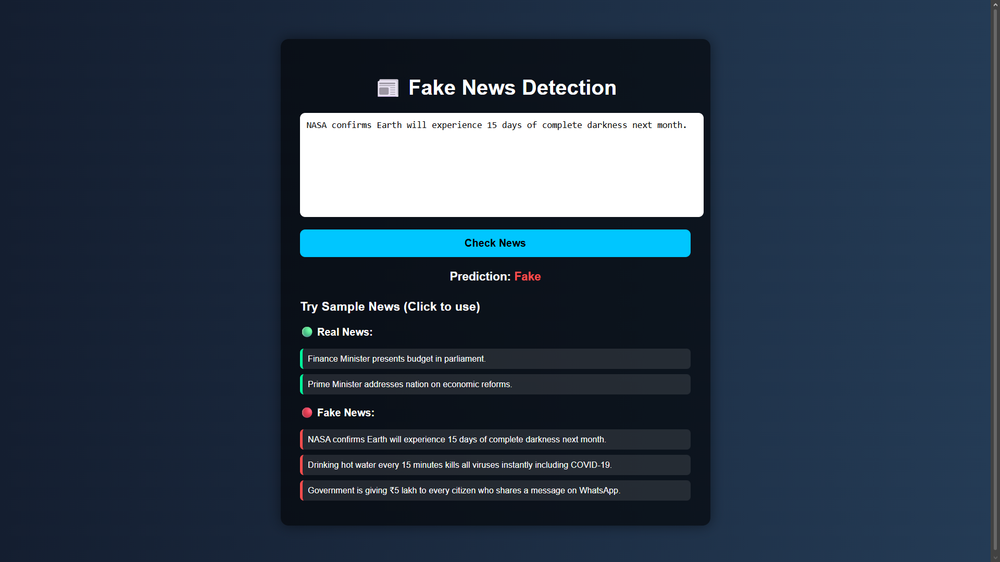

# 📰 Fake News Detection System

A machine learning-based web application that classifies news articles as **Fake** or **Real** using Natural Language Processing (NLP) and a Django backend.

---

## 🚀 Features

- 🔍 Detects whether a news article is Fake or Real
- 🧠 Uses **TF-IDF Vectorization** for text processing
- 🤖 Trained with **Logistic Regression**
- 🌐 Web interface built using **Django**
- 📊 Includes **Model Evaluation & Analysis**
  - Confusion Matrix
  - Accuracy & Classification Report
  - Feature Importance Analysis
- ⚠️ Handles dataset bias and explains model limitations

---

## 🛠️ Tech Stack

- **Python**
- **Django**
- **Scikit-learn**
- **Pandas / NumPy**
- **Matplotlib / Seaborn**
- **HTML / CSS**

---

## 📂 Project Structure

FakeNewsDetection/
│
├── FakeNewsDetection/ # Main Django project
├── Truthify/ # App folder
├── templates/ # HTML files
├── model.pkl # Trained ML model
├── vectorizer.pkl # TF-IDF vectorizer
├── requirements.txt
└── README.md

---

## ⚙️ How It Works

1. User inputs news text in the web interface  
2. Text is transformed using **TF-IDF Vectorizer**  
3. Model predicts whether news is **Fake or Real**  
4. Result is displayed on the webpage  

---

## 📊 Model Details

- Algorithm: **Logistic Regression**
- Vectorization: **TF-IDF (with n-grams)**
- Evaluation Metrics:
  - Accuracy
  - Precision / Recall / F1-score
  - Confusion Matrix

---

## 📈 Analysis Performed

- ✔ Feature correlation using model coefficients  
- ✔ Identification of dataset bias (e.g., source-specific words)  
- ✔ Feature importance visualization  
- ✔ Model behavior analysis  

---

## ⚠️ Limitations

- Model may rely on writing style rather than factual correctness  
- Dataset contains bias from specific news sources  
- Performs better on **longer news text** than short headlines  

---

## 🚀 Future Improvements

- Use advanced models like **BERT / Transformers**
- Improve dataset quality for better generalization
- Add confidence score in predictions
- Deploy application online

---

## ▶️ How to Run

pip install -r requirements.txt
python manage.py runserver
Then open:
http://127.0.0.1:8000/

---

## 📸 Screenshots

